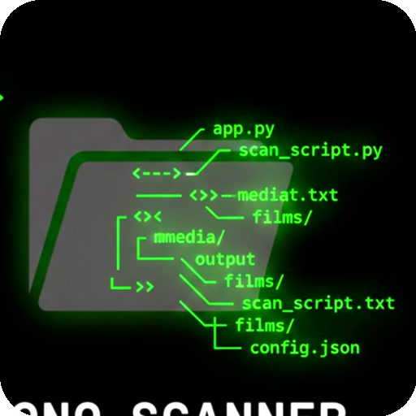
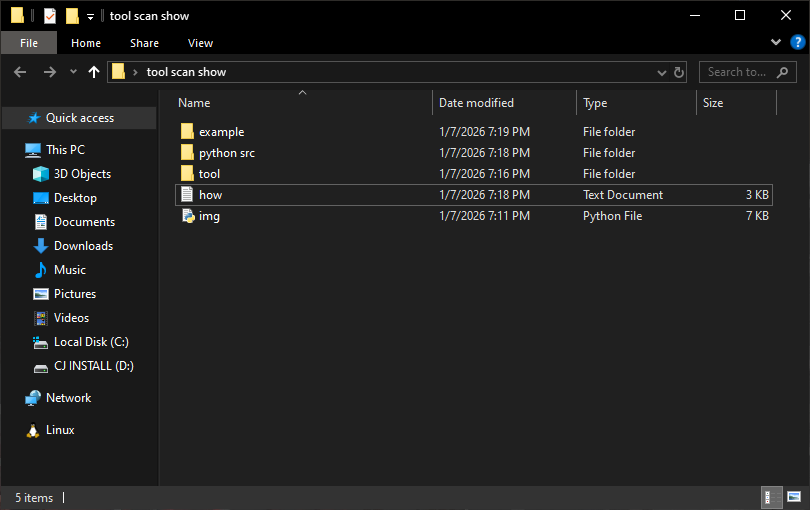
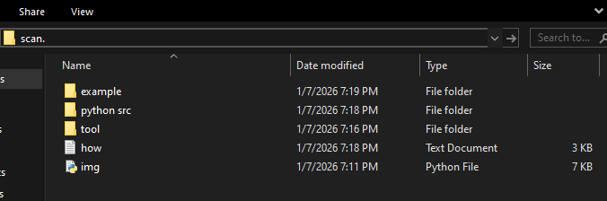
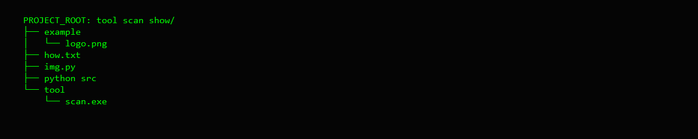

# Fast-Scan-Folder [download](https://github.com/YASSER-27/Fast-Scan-Folder/releases/tag/v1)

### SCANNER Report is a specialized technical utility designed with a high-contrast Monochromatic (Mono) interface. It is engineered to assist developers, system administrators, and content managers in auditing and visualizing directory hierarchies with precision and speed.

---

---

---

